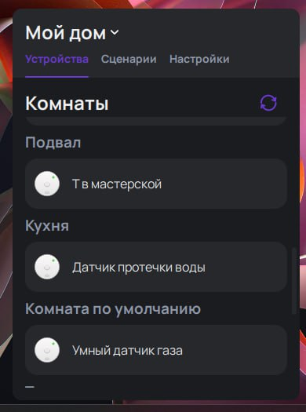
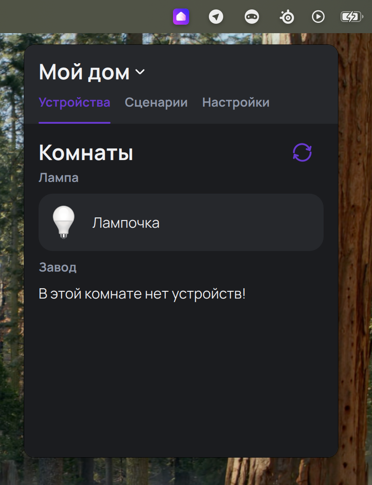

# Yandex Home Desktop
Приложение для управление устройствами умного дома яндекс с компьютера.

Windows            |  MacOS
:-------------------------:|:-------------------------:
 | 

# Tray режим
Одно из нововведений этой версии - tray режим, теперь приложение может выполнять ещё и функцию desktop приложения, но при желании может быть использовано из системного трея

# Поддерживаемые устройства
В отличии от [предыдущей версии](https://github.com/Yagodnik/YandexHomeWidgets) теперь поддерживаются все устройства, умения (исключением является умение ```devices.capabilities.video_stream```) и свойства. Однако, далеко не все из них протестированны полноценно.

# Сборка
| Build Status         | Branch |
|---------------------|---------|
| [](https://github.com/Yagodnik/YandexHomeDesktop/actions/workflows/build-windows.yml) | main |
| [](https://github.com/Yagodnik/YandexHomeDesktop/actions/workflows/build-windows.yml) | dev |

# Credits
Список изображений, которые я использовал: 
1) Картинки с https://yandex.ru/quasar/
2) https://www.svgrepo.com/svg/526106/play
3) https://www.svgrepo.com/svg/507358/logout
4) https://www.svgrepo.com/svg/520909/reload
5) https://www.svgrepo.com/svg/500472/back
6) https://www.svgrepo.com/svg/521486/arrow-up
7) https://www.svgrepo.com/svg/458827/on-button