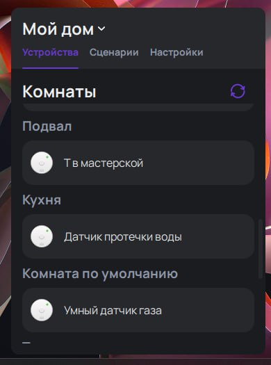
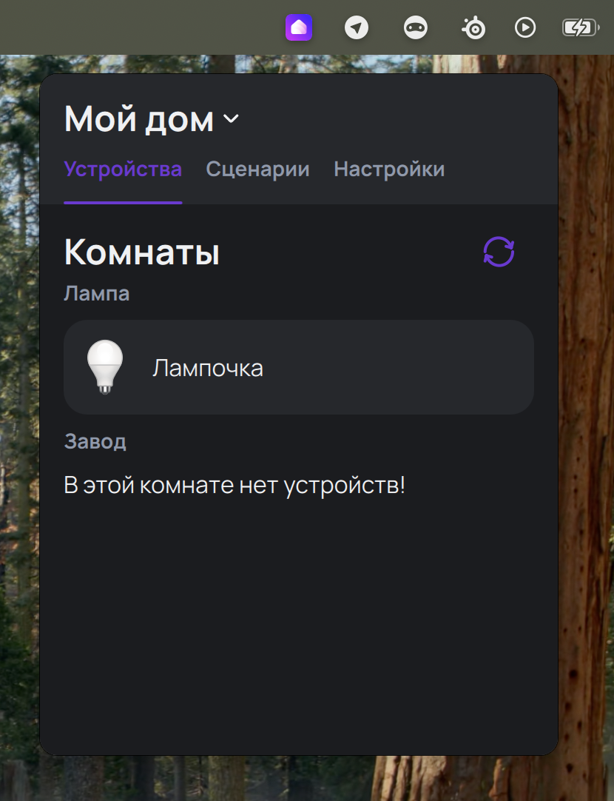

# Yandex Home Desktop
Приложение для управление устройствами умного дома яндекс с компьютера.

Windows            |  MacOS
:-------------------------:|:-------------------------:
 | 

# Tray режим
Одно из нововведений этой версии - tray режим, теперь приложение может выполнять ещё и функцию desktop приложения, но при желании может быть использовано из системного трея

# Поддерживаемые устройства
В отличии от [предыдущей версии](https://github.com/Yagodnik/YandexHomeWidgets) теперь поддерживаются все устройства, умения (исключением является умение ```devices.capabilities.video_stream```) и свойства. Однако, далеко не все из них протестированны полноценно.

# Сборка

Для сборки на macOS и Windows нужны CMake 3.28+, Ninja, Qt 6.9+ (Quick, NetworkAuth, Widgets, Svg, Qt5Compat и LinguistTools) и компилятор C++23. CMake загрузит закреплённые версии Boost.Hana и QtKeychain. По умолчанию в приложение включается тестовая OAuth-конфигурация `resources/auth/example.json`: приложение соберётся, но вход в аккаунт с ней не работает.

```sh
cmake -S . -B build -G Ninja -DCMAKE_PREFIX_PATH=/path/to/Qt/6.x/macos -DBUILD_DESKTOP_APP=ON
cmake --build build --parallel 4
ctest --test-dir build --output-on-failure
```

В корне проекта есть `justfile` с командами для сборки, запуска GUI и CLI, тестов и переводов. Нужны just 1.51.0 и Python 3.9+; список команд покажет `just`. Например:

```sh
just qt_prefix=/path/to/Qt/6.x/macos configure
just demo
just cli --fake-api devices list --json
just rest --fake-api
just config=Release qt_prefix=/path/to/Qt/6.x/macos build
just test
```

Профили Debug, Release и переносимые тесты используют отдельные каталоги сборки. Параметры и дополнительные флаги описаны в [docs/build.md](docs/build.md#just-commands).

Для ускорения сборки по умолчанию включены предкомпилированные заголовки (PCH).
Их можно отключить при конфигурации CMake с помощью `-DYH_ENABLE_PCH=OFF`.
Объявления сериализуемых типов находятся в `serialization/SerializationTypes.h`;
полный `serialization/Serialization.h` нужен для инстанцирования сериализаторов.
Используемые сериализаторы общих API-моделей компилируются один раз в библиотеке `YandexApiAdapter`.

Для работающего входа создайте свою конфигурацию OAuth и передайте `-DYH_AUTH_CONFIG_FILE=/path/to/oauth.json` (или `-DAUTH_CONFIG_FILE=...`). Файл встраивается в приложение. Инструкции и вариант для Linux-тестов приведены в [docs/build.md](docs/build.md).

CI собирает и тестирует приложение на macOS и Windows, а на Linux запускает переносимые тесты. Сборки CI используют тестовую OAuth-конфигурацию. Для релизов используется тег `vMAJOR.MINOR.PATCH`; шаги описаны в [release workflow](.github/workflows/release.yml).

# CLI

Для Windows, macOS и Linux собирается отдельный консольный `YandexHomeCli`. Сначала войдите в аккаунт через desktop-приложение; CLI использует сохранённый вход. На macOS установленный CLI находится в `YandexHomeDesktop.app/Contents/MacOS/YandexHomeCli`, на Windows — рядом с `YandexHomeDesktop.exe`.

```sh
YandexHomeCli devices list --json
YandexHomeCli devices show --id lamp
YandexHomeCli devices set --id lamp --capability on_off --value on
YandexHomeCli scenarios run --id evening
YandexHomeCli --help
```

Поддерживаются range, mode, toggle и color_setting, поиск по ID или точному имени, фильтр дома, JSON и коды завершения для автоматизации. Старые аргументы (`--list-devices`, `--on_off`, `--account-info`, `--reset`) сохранены в CLI; GUI запускается отдельно. Сброс требует `reset --i-know-what-i-am-doing`.

Примеры всех команд, формат ошибок и устройство расширяемых команд описаны в [docs/cli.md](docs/cli.md).

Локальный REST API включается командой `YandexHomeCli --enable-rest`, выключается
через `--disable-rest`; состояние показывает `--status-rest`. Сервер работает
в фоне и управляется также в разделе «Настройки → Дополнительно». В Debug можно
добавить `--fake-api`. Отдельный процесс `YandexHomeRest` можно запустить через `just rest`; локальный API не требует токена. Маршруты и запуск Python-примера из
`examples/rest_client.py` описаны в [docs/rest.md](docs/rest.md).

GUI, CLI и REST используют общие динамические библиотеки. Пример внешнего CMake-проекта — [examples/sdk](examples/sdk); установка и публичные цели описаны в [docs/sdk.md](docs/sdk.md).

# Credits
Список изображений, которые я использовал: 
1) Картинки с https://yandex.ru/quasar/
2) https://www.svgrepo.com/svg/526106/play
3) https://www.svgrepo.com/svg/507358/logout
4) https://www.svgrepo.com/svg/520909/reload
5) https://www.svgrepo.com/svg/500472/back
6) https://www.svgrepo.com/svg/521486/arrow-up
7) https://www.svgrepo.com/svg/458827/on-button
