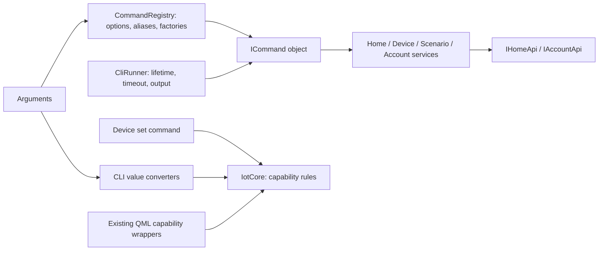

# CLI

`YandexHomeCli` is the console executable on Windows and macOS. It runs with a
`QCoreApplication`: it creates no QML engine, device view model, polling session,
tray, or desktop platform service. The desktop executable accepts the same
arguments for compatibility. Sign in through the desktop app first; CLI commands
read the same saved keychain token. `--help` and argument validation run before
authentication. Confirmed reset does not require reading a saved login. The CLI
does not open a browser to sign in.

On macOS, both console entry points select Qt's Core Foundation event dispatcher
before constructing the application. QtKeychain delivers completion callbacks
through the native main queue; the default console dispatcher would leave these
callbacks pending after the password prompt.

The build produces `<build-dir>/YandexHomeCli` on macOS and
`<build-dir>/YandexHomeCli.exe` on Windows. Installation places it alongside the
Windows desktop executable, or inside
`YandexHomeDesktop.app/Contents/MacOS/YandexHomeCli` on macOS. The macOS binary
shares the bundle's deployed Qt frameworks.

## Commands

```sh
YandexHomeCli --help
YandexHomeCli devices list --json
YandexHomeCli devices list --household home
YandexHomeCli devices show --id lamp --json
YandexHomeCli devices show --name "Desk lamp" --household home
YandexHomeCli devices set --id lamp --capability on_off --value on
YandexHomeCli devices set --id lamp --capability range --instance brightness --value 50
YandexHomeCli devices set --id speaker --capability range --instance volume --value=-5 --relative
YandexHomeCli devices set --id fan --capability mode --instance work_speed --value auto
YandexHomeCli devices set --id speaker --capability toggle --instance mute --value true
YandexHomeCli devices set --id lamp --capability color_setting --instance rgb --value '#33aaee'
YandexHomeCli devices set --id lamp --capability color_setting --instance hsv --value '{"h":120,"s":80,"v":50}'
YandexHomeCli devices set --id lamp --capability color_setting --instance temperature_k --value 3000
YandexHomeCli devices set --id lamp --capability color_setting --instance scene --value sunrise
YandexHomeCli scenarios list --json
YandexHomeCli scenarios run --id evening
YandexHomeCli account show --json
YandexHomeCli reset --i-know-what-i-am-doing
```

Quoting above uses a POSIX shell; adapt it to your Windows shell. In particular,
use `--value=-5` for negative numbers. Commands take one exact `--id` or `--name`.
Duplicate names fail with matching IDs instead of choosing an arbitrary target.
For devices, `--household` filters a list or scopes name lookup. IDs bypass the
home-list request. Scenario names must be unique across the returned list.
`--device-id` and `--device-name` remain aliases for the selectors.

`devices show` includes device state, capabilities, parameters, and properties.
Use those parameters to choose supported instances and values. Set commands check
capability presence, range limits, relative-only ranges, advertised modes, color
models, temperature limits, and scenes. Boolean values accept `on/off` and
`true/false`; range values must be finite. RGB accepts decimal integers,
`#RRGGBB`, or `0xRRGGBB`. HSV requires numeric `h` (0–360), `s` and `v` (0–100).
Scenario execution rejects inactive scenarios.

A successful action means the API acknowledged it. The command does not perform
an extra read to confirm the physical state, automatically retry an action, or
apply the desktop's optimistic state and polling suppression rules. Other clients
can change the device after the snapshot used for validation.

Old invocations remain supported:

```sh
YandexHomeCli --list-devices
YandexHomeCli --on_off "Desk lamp" --value on
YandexHomeCli --on_off "Desk lamp" --info
YandexHomeCli --account-info
YandexHomeCli --reset --i-know-what-i-am-doing
```

## Automation contract

Interactive commands show an animated progress bar on stderr while reading the
saved login and executing the command. Results are printed after the indicator
is cleared. Add `--no-progress` to disable it:

```sh
YandexHomeCli devices list --no-progress
```

Progress is automatically disabled with `--json` and when stderr is not a
terminal. Redirect stderr as well when capturing plain output without progress.
Help and argument validation do not display progress.

Add `--json` or `-j` for a single JSON object on stdout on success, or stderr on
failure. Protocol keys and error codes are stable strings; display messages use
the system UI language. Commands reject unknown, repeated, and inapplicable
options. `--timeout` sets the total budget, including saved-token lookup and all
requests (1–3600000 milliseconds; default 30000). Timeout cancels callback delivery;
an action already sent to the API may still have taken effect.
macOS password prompts also count toward this budget. Use, for example,
`--timeout 120000` if approving Keychain access needs more time.

Examples:

```json
{"ok":true,"device_id":"lamp","capability":"devices.capabilities.on_off","state":{"instance":"on","value":true}}
```

```json
{"ok":false,"error":{"code":"ambiguous_target","message":"Several devices matched. Specify --id or --household.","matches":[{"id":"lamp","name":"Lamp","household_id":"home"},{"id":"cabin-lamp","name":"Lamp","household_id":"cabin"}]}}
```

| Exit | Meaning |
| --- | --- |
| 0 | Success or help |
| 1 | API, transport, response, or startup failure |
| 2 | Invalid command/value, ambiguity, or inactive scenario |
| 3 | Sign-in required, denied, or failed; HTTP 401/403 |
| 4 | Target/capability/household missing; HTTP 404 |
| 5 | Total budget or API timeout |

## Extending the CLI



`CliCommand` contains only a parsed `ICommand` and global invocation settings.
It has no command enum, operation dispatch, or capability-value conversion.
`CommandRegistry` finds a registered path and calls its factory. Factories parse
and validate their module's options into immutable command objects. Execution
uses the injected `CliContext` services and reports completion or a structured
failure. `CliRunner` owns the delivery context, timeout, output formatting, and
exit status. API callbacks stop delivering when that context is destroyed.

To add a command:

1. Implement `ICommand::Execute(CliContext&)` in the appropriate module under
   `src/cli/commands/`. Use services, pass `context.Owner()` to every asynchronous
   request, and report one completion through the context.
2. Register its path, description, allowed options, and parsing factory. Add
   option descriptors with `AddOption`; the registry generates help. Add a
   `LegacyAlias` if an old syntax should normalize into this command.
3. For a new module, call its registration function from `CommandRegistry::Builtin`
   and declare its source in `src/cli/CMakeLists.txt`. Neither the parser nor runner
   needs an operation branch.
4. Add deterministic tests and translate any new display text. Keep request and
   response details in API/services rather than adding transport to the command.

The existing `src/iot/capabilities/` wrappers and CLI reuse `IotCore` from
`src/iot/core/`: payload builders, range/color parameter access, instance matching,
and typed value/device validation. This library depends on Qt Core and API
contracts, with no QML, QColor, or CLI dependency. Existing QML `Create(...)`
methods delegate to its builders and preserve their current signals, payloads,
and QColor conversion behavior. Validation is explicit: this migration does not
start rejecting actions previously accepted by the desktop UI.

Files under `src/cli/capabilities/` implement `ICapabilityInput` and only convert
command text into typed values: booleans, numbers, hexadecimal RGB, or JSON HSV.
They build state through `Iot::State` and provide shared `ICapabilityRules`.
`CapabilityCommands` handles registration and input validation; `devices set`
uses the shared rules to match and validate the device snapshot.

To extend capability support, implement the domain rules in `IotCore`, add a text
converter if the CLI needs a new syntax, and register its `ICapabilityInput`.
Alternate registries can be injected into `RegisterDeviceCommands`. A new API
capability also requires extending the domain/API representation. REST
and MCP adapters can pass typed values directly to the same builders and rules.

Command parsing proceeds through syntax parsing, canonical option/timeout checks,
legacy normalization, registered command lookup, and the command factory's
argument parsing. It does not dispatch operations or interpret device metadata.

The `Cli` unit suite checks the extension points, value handling, target lookup,
API errors, synchronous callbacks, timeout cancellation, and caller destruction
without GUI or network access. `CliProcess_*` checks both executable entry points;
Debug builds use the committed fixture. Windows CI builds and runs the same tests
in Debug/Release with PCH on/off. To try a credential-free Debug command:

```sh
YandexHomeCli --fake-api devices show --id lamp --json
```

Fixture mode deliberately fails device actions instead of claiming they reached
hardware. Release binaries reject fixture flags.
