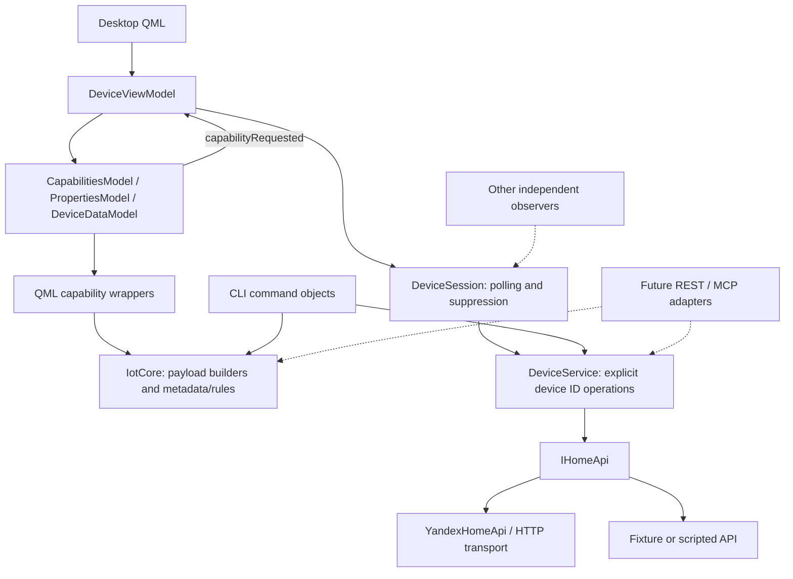

# Device control architecture

The first migration separates device operations and polling from the desktop's
presentation state. The behavior contract in
[device-control-behavior.md](device-control-behavior.md) remains the compatibility
baseline, including its concurrent-action and out-of-order-response quirks.

## Responsibilities

`IotCore` contains the capability payload builders extracted from the existing
QML wrappers, range/color parameter accessors, and typed input/device validation.
Both CLI and QML wrappers depend on this Qt Core-only library. The wrappers retain
their public API and original behavior; the CLI owns text conversion and opts into
validation. REST/MCP adapters can reuse the same core with already typed values.

`DeviceService` has no selected device, timer, model, or GUI dependency. Reads and
commands take an explicit device ID, caller-owned callback context, and a typed
`ApiResult` callback. Commands preserve the capability type and state map exactly,
including relative actions and color instances. Transport, response parsing, and
authentication remain behind `IHomeApi` in `src/api` and `src/auth`.

`DeviceSession` owns one consumer's selected device, three-second polling timer,
row suppression state, and injected clock. Multiple sessions can use the same
service without sharing their selection or suppression windows. The API uses the
session as its callback context, so destroying a session prevents delivery of its
outstanding callbacks. A session emits raw metadata before filtered capability
updates, and always forwards properties.

`DeviceViewModel` owns the session and the three display models. It resets the
models before starting a load, forwards failures, and exposes persistent
`Loading`, `Error`, and `Ready` state. QML binds to that state instead of counting
initialization signals. This also permits the device row to start loading before
navigation creates the page: a completed load is visible to a newly created page.

The display models retain their QML roles, properties, and signals. Their normal
constructors have no controller dependency. Capability controls keep their
existing `UseCapability` calls: the model updates its optimistic display state
and emits `capabilityRequested`; the view model routes it to the session. The
models do not send API requests, schedule polling, or choose suppression policy.

`DeviceController` and the controller-taking model constructors remain thin C++
compatibility adapters. The desktop creates `DeviceViewModel` directly. Existing
`deviceController`, `capabilitiesModel`, `propertiesModel`, and `deviceDataModel`
QML context names alias the view model and its owned models during migration.
There is only one implementation of polling and reconciliation, in the session.

## Behavior preserved in this migration

The 800 ms window, whole-row suppression, optimistic writes, lack of rollback,
shared pending flag for repeated commands, and shared most-recent read start time
remain unchanged. Responses are not serialized or rejected by timestamp. Action
completion still addresses the current session's row, even after changing its
selected device. Stopping polling is not a persistent pause: an accepted response
can restart it. Failures retain the existing model notifications and online-state
behavior. These are separate candidates for future behavior changes, rather than
implicit changes made while moving code.

## Next implementation steps

1. Add REST and MCP adapters over the same explicit-ID operations. Each request
   owns its callback context and maps `ApiResult` to its protocol's response.
   Add adapter tests for validation, errors, and overlapping requests. Long-lived
   observers can own a `DeviceSession`; one-shot commands need no session.
2. After consumers migrate, remove the controller compatibility adapters and
   old context aliases. Evaluate any conflict-policy changes separately, with
   deliberate changes to the characterization expectations and behavior contract.

The CLI now uses the explicit-ID service operations with a headless bootstrap and
registered command/capability objects. See [cli.md](cli.md). REST/MCP adapters and
conflict-policy changes remain future work.

## Verification

`DeviceControl` runs the original desktop/mobile timelines through the production
view model and its owned models; the original expected outcomes are unchanged.
It also checks loading, retry, and initialized-page behavior after polling fails.
`DeviceService` links only `AppServices` and Qt Core/Test, proving that explicit-ID
commands and independent polling sessions run without GUI or QML. It checks
structured results, callback lifetimes, synchronous response ordering, and timer
lifecycle without sleeps or network access.

The desktop QML tests use the real device view model. They cover failure-dialog
dismissal followed by retry, readiness before page creation, and mouse clicks on
a real on/off delegate reaching the service and updating optimistic display state.
All targets are included in the existing Windows/macOS desktop CTest path and
the service and characterization suites are included in portable builds.
